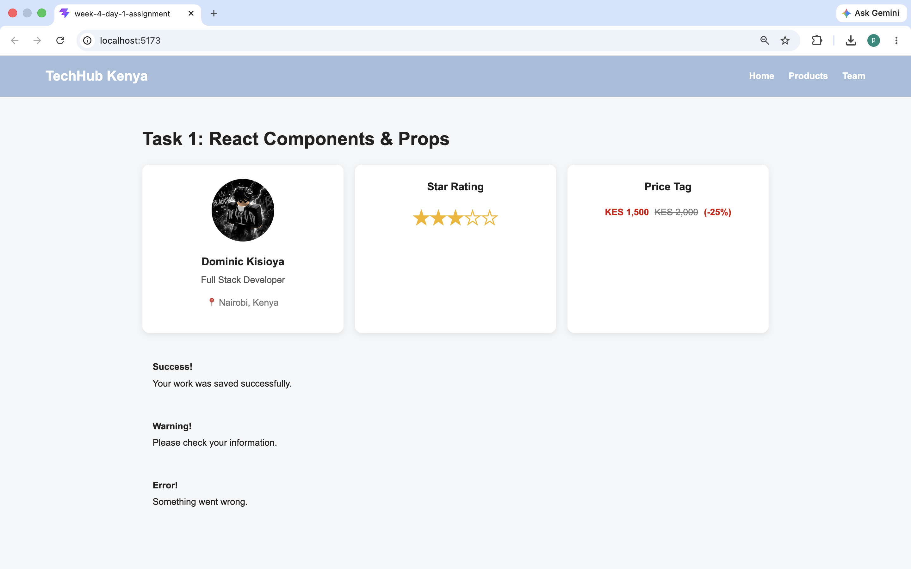
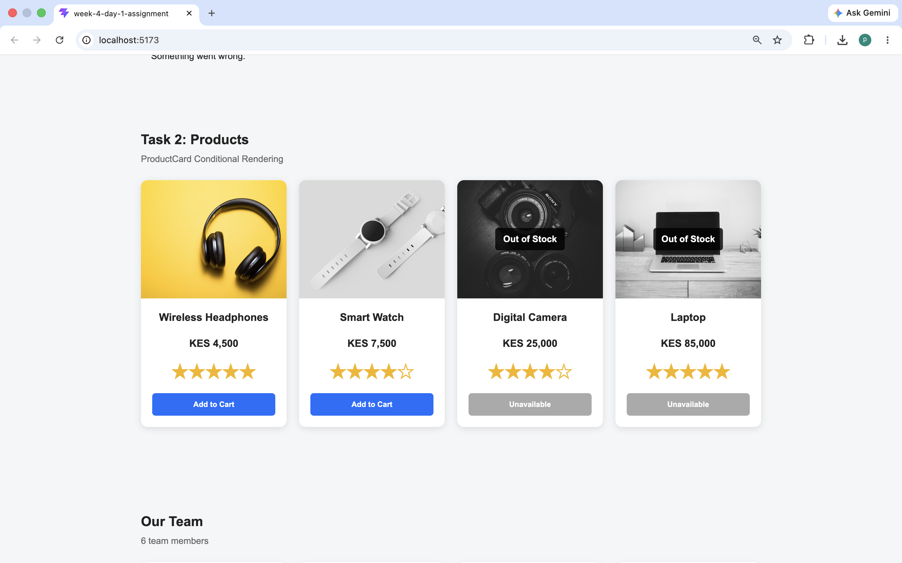

# Week 4 Day 1 Assignment - React Components and Props

## Overview

This project was completed as part of the **Week 4 React assignment** and focuses on building reusable user interface components using React.

The main goal of the assignment is to understand how React applications are structured using components and how data can be passed between components using props.

The project includes reusable components such as:

- Profile cards
- Star ratings
- Price tags
- Alert boxes
- Navigation bars
- Product cards
- Team member cards
- A complete team roster page

It also demonstrates how React can dynamically display different content based on data values, such as whether a product is available or out of stock.

---

## Assignment Objectives

The main objectives of this project are to practise and demonstrate:

- Creating React functional components
- Passing data using props
- Destructuring props
- Creating reusable components
- Rendering arrays using `.map()`
- Passing arrays as props
- Conditional rendering
- Using default prop values
- Using the `children` prop
- Styling React components with CSS
- Organising components into separate files
- Using `useState`
- Handling mouse and click events
- Building responsive React interfaces

---
# Live Pages
https://dominic-kores.github.io/week-4-day-1-assignment/

---

# Technologies Used

The following technologies and tools were used to complete the project:

- React
- JavaScript
- JSX
- HTML
- CSS
- Vite
- npm
- Git
- GitHub
- Visual Studio Code

---

# Project Structure

The project follows a component-based React structure.

---
# Screenshots




```text
week-4-day-1-assignment/
│
├── public/
│
├── src/
│   │
│   ├── components/
│   │   ├── ProfileCard.jsx
│   │   ├── StarRating.jsx
│   │   ├── PriceTag.jsx
│   │   ├── AlertBox.jsx
│   │   ├── NavBar.jsx
│   │   ├── ProductCard.jsx
│   │   ├── MemberCard.jsx
│   │   └── TeamPage.jsx
│   │
│   ├── App.jsx
│   ├── App.css
│   ├── index.css
│   └── main.jsx
│
├── screenshots/images
│
├── package.json
├── package-lock.json
├── vite.config.js
└── README.md

